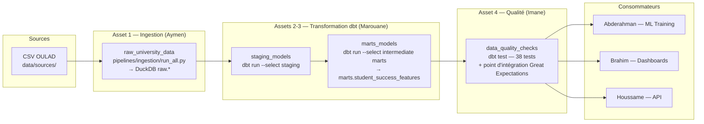

# Flux d'orchestration — Dagster (Maroua)

> Livrable : Data Engineer (Orchestration) — Plateforme intelligente pour la réussite universitaire

## Vue d'ensemble

L'orchestration coordonne l'exécution **ordonnée, automatisée et fiable** de toute la chaîne
de données du projet, via des **Software-Defined Assets** Dagster. Chaque étape est un asset
traçable dans l'interface Dagit, avec historique des runs, retries automatiques et alerting.

## Diagramme du pipeline



## Déclencheurs d'exécution

| Déclencheur | Nom | Comportement |
|---|---|---|
| **Schedule** | `daily_pipeline_schedule` | Cron `0 2 * * *` — exécution quotidienne à 02h00 (Africa/Casablanca) |
| **Sensor** | `new_source_file_sensor` | Scanne `data/sources/` toutes les 60 s ; déclenche un run dès qu'un CSV apparaît ou est modifié (empreinte nom + mtime, curseur anti-doublon) |
| **Manuel** | Dagit UI / CLI | Bouton *Materialize all* dans Dagit, ou `dagster job launch` |

## Jobs disponibles

- **`university_success_pipeline`** : pipeline complet (les 4 assets, dans l'ordre des dépendances).
- **`transformation_only_job`** : dbt + tests uniquement — utile quand seuls les modèles SQL changent.

## Garanties d'ordre (dépendances)

Les dépendances déclarées dans `assets.py` (`deps=[...]`) garantissent que Dagster **ne lance
jamais** la transformation avant la fin de l'ingestion, ni les checks qualité avant les marts.
Si un asset amont échoue (après épuisement des retries), les assets aval sont **automatiquement
annulés** — aucune donnée corrompue ne se propage vers l'équipe ML.

## Exécution locale (sans Docker)

```bash
pip install -r pipelines/orchestration/requirements.txt
dagster dev -w pipelines/orchestration/workspace.yaml
# Dagit disponible sur http://localhost:3000
```

## Exécution via Docker (infra de Soumia)

```bash
cd infra/docker
docker-compose up -d --build
# Dagit : http://localhost:3000 — MLflow : http://localhost:5000
```

⚠️ **Coordination Soumia** : l'image du workspace doit inclure `dbt-duckdb` et `pandas`
(voir `pipelines/orchestration/requirements.txt`) et copier `data/sources/` ou monter le
volume `../../data:/opt/dagster/app/data` (déjà prévu dans son docker-compose).
La variable `DAGSTER_REPO_ROOT=/opt/dagster/app` doit être définie dans le service
`dagster_workspace`.
