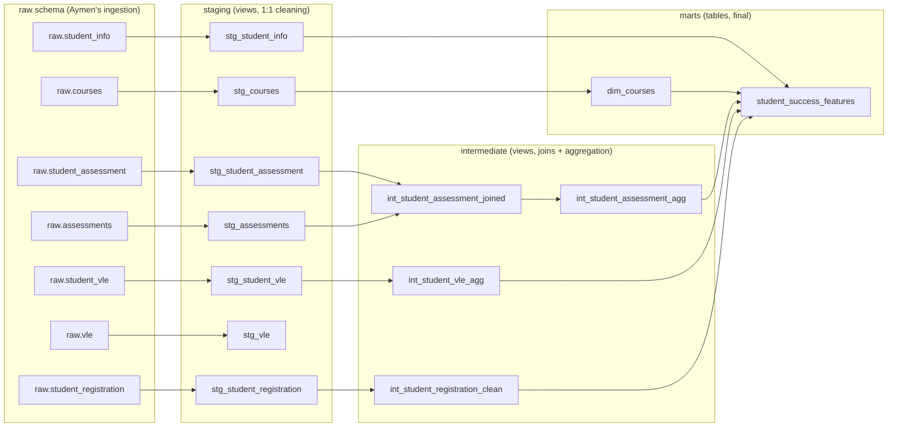

# Transformation Layer — Lineage

Owner: Marouane. This is the dbt DAG for `pipelines/transformation/`.
The interactive, column-level version of this lineage graph is inside
`docs/dbt_docs/index.html` (open it locally, click "View Lineage Graph").

## Grain of each layer

| Layer | Grain | Materialization |
|---|---|---|
| staging | same as source (1 row per source row) | view |
| intermediate | mostly 1 row per student per presentation (except `int_student_assessment_joined`, which is 1 row per submission) | view |
| marts | 1 row per student per course presentation | table |

## Handoff

`marts.student_success_features` (also exported to `data/marts/student_success_features.csv`
and `.parquet`) is the contract with the rest of the team:

- **Abderahman** trains models on it (`ml/training/`).
- **Brahim** builds dashboards on it (`dashboards/`).
- **Imane** should point her Great Expectations suites at `staging` and `marts`
  schemas, not `raw` — raw is intentionally messy (that's Aymen's layer).
- **Maroua** wraps `dbt run` + `dbt test` as a Dagster op/asset that runs
  after ingestion and before quality checks/training.
